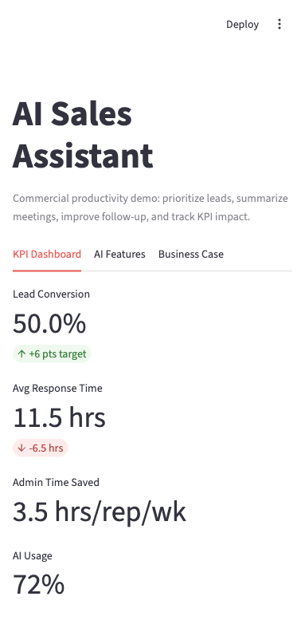
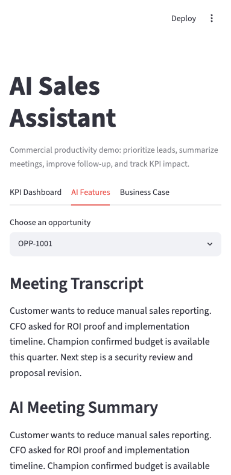
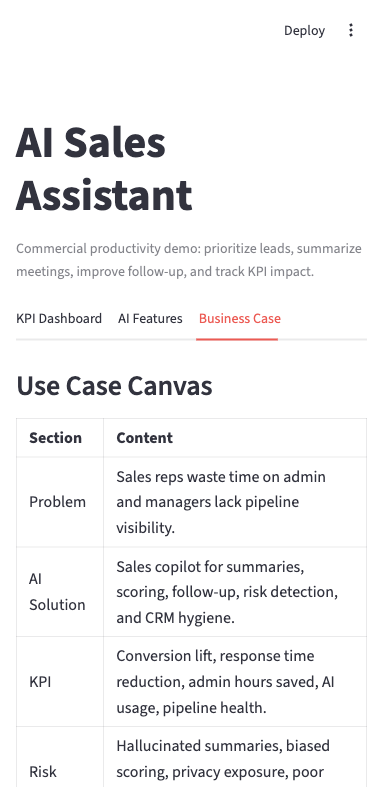

# AI Sales Assistant

Purpose: show how AI improves commercial team productivity by helping sales teams save time, prioritize leads, improve follow-up, and increase conversion.

## Scenario

You are advising a B2B sales organization where reps manually summarize meetings, leads are not consistently prioritized, managers lack pipeline visibility, and CRM notes vary in quality.

## Project Overview

AI Sales Assistant is a Streamlit dashboard and AI sales copilot prototype. It demonstrates how AI can help B2B sales teams save time, prioritize leads, improve follow-up, and increase conversion.

The project combines business analysis, sample CRM data, AI-assisted sales features, and KPI tracking in one practical demo.

## Dashboard Screenshots

### KPI Dashboard



### AI Features



### Business Case



## AI Features

| Feature | Description |
| --- | --- |
| AI Meeting Summarizer | Summarizes sales meeting notes into customer needs, risks, buying signals, and next steps. |
| Lead Scoring | Prioritizes opportunities using deal value, probability, engagement, decision makers, and recent activity. |
| Email Drafting Assistant | Creates follow-up email drafts based on meeting context. |
| Opportunity Risk Detection | Flags risks such as stale activity, competitor presence, and messy CRM notes. |
| CRM Note Cleanup | Converts inconsistent CRM notes into a cleaner structured format. |

## Business KPIs

| KPI | What It Measures |
| --- | --- |
| Lead Conversion | How many opportunities convert into won deals. |
| Average Response Time | How quickly reps follow up after meetings. |
| Admin Time Saved | Estimated time saved from AI-assisted summaries, notes, and drafts. |
| AI Usage | Adoption of AI features across sales workflows. |
| Pipeline Health | Opportunity quality based on score, activity, and risk signals. |

## Deliverables

- [Executive summary](docs/executive_summary.md)
- [AI use case canvas](docs/ai_use_case_canvas.md)
- [Stakeholder map](docs/stakeholder_map.md)
- [Pain points and process flow](docs/process_flow.md)
- [KPI baseline](docs/kpi_baseline.md)
- [Architecture diagram](docs/architecture.md)
- [Public data source options](docs/data_sources.md)
- Streamlit KPI dashboard and AI feature demo in [src/app.py](src/app.py)

The app uses deterministic demo logic by default. If `OPENAI_API_KEY` is set, the text-generation features can call the OpenAI API.

## Quick Start

```bash
cd "ai-sales-assistant"
python3 -m venv .venv
source .venv/bin/activate
pip install -r requirements.txt
streamlit run src/app.py
```

Optional:

```bash
export OPENAI_API_KEY="your_key_here"
```

## Project Story

The project demonstrates a practical AI sales copilot: CRM data flows into Python, AI features generate summaries and recommendations, and the dashboard tracks conversion, time saved, response time, AI usage, and pipeline health.
