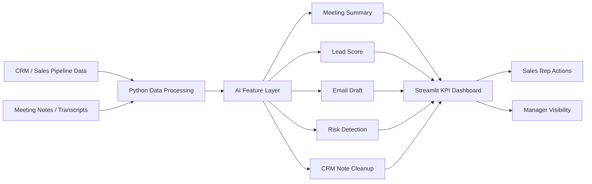

# Architecture Diagram

## Component View

| Component | Role |
| --- | --- |
| CRM data | Opportunity, account, activity, deal stage, and outcome information. |
| Python/API layer | Cleans data, calculates KPIs, calls AI functions, and prepares dashboard tables. |
| LLM layer | Generates summaries, follow-up recommendations, email drafts, sentiment, and note cleanup. |
| Dashboard | Shows conversion, time saved, AI usage, pipeline risk, and priority opportunities. |
| Human review | Sales reps approve summaries and email drafts before CRM or customer use. |
