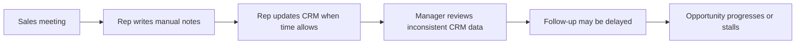
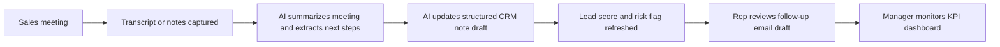

# Pain Points And Process Flow

## Pain Points

| Pain Point | Business Impact | AI Feature |
| --- | --- | --- |
| Reps manually summarize meetings. | Less selling time and delayed follow-up. | Meeting summarizer. |
| Leads are not prioritized consistently. | High-value opportunities may be missed. | Lead scoring. |
| Managers lack visibility into stale or risky deals. | Forecast risk and missed coaching moments. | Opportunity risk detection. |
| CRM notes are inconsistent. | Poor handoffs and unreliable reporting. | CRM note cleanup. |
| Follow-up emails take too long to write. | Slower response time and weaker buyer experience. | Email drafting assistant. |

## Current Process

## Future AI-Assisted Process

